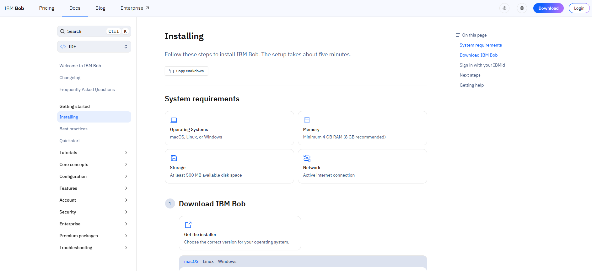
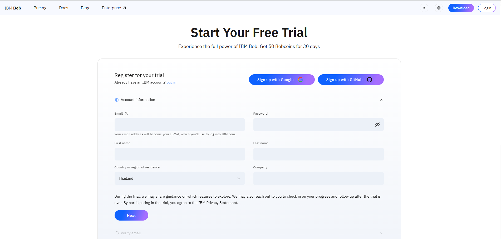
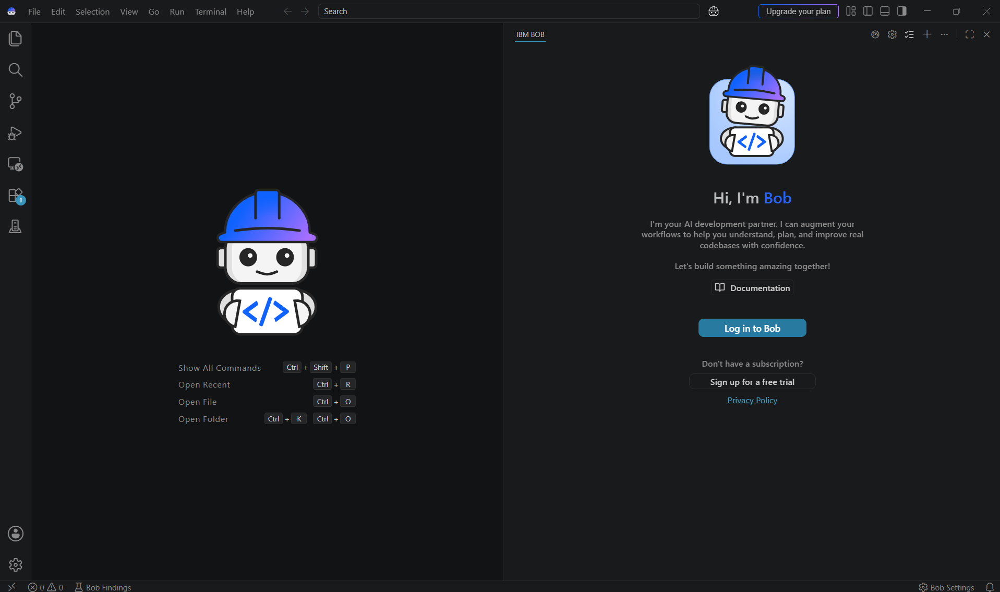
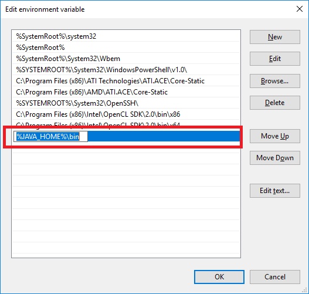
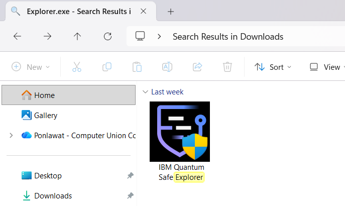
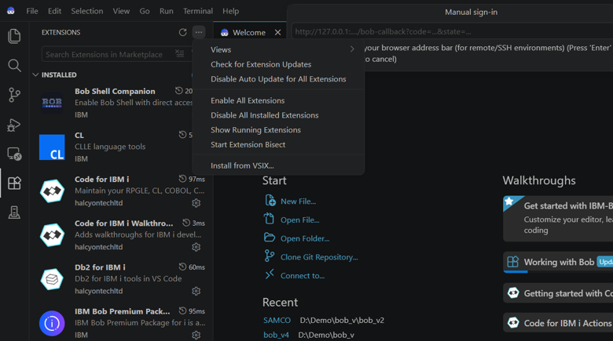
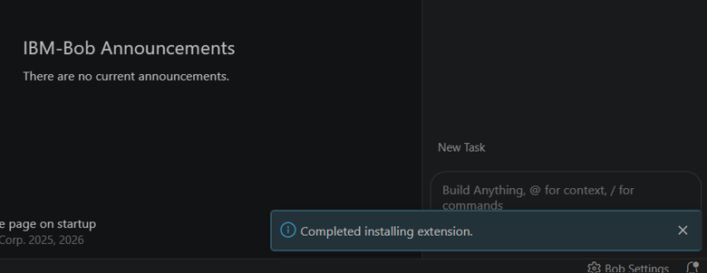
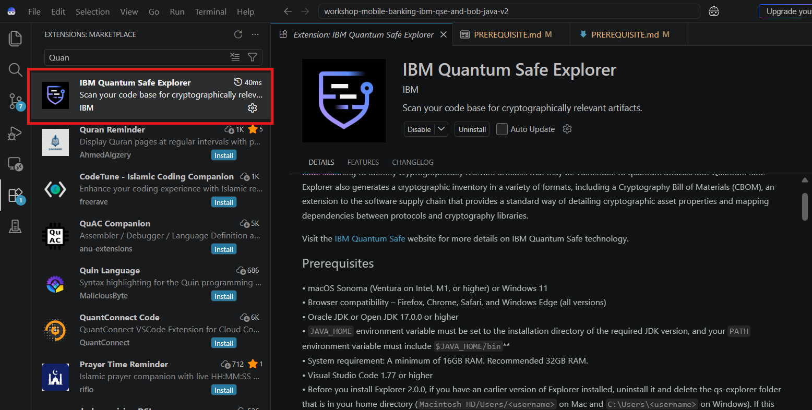

# Lab Prerequisites

Before starting the **IBM QSE + IBM Bob Workshop**, make sure your machine meets the system requirements and has all of the following installed and configured.

---

## 1. System Requirements

### Operating System

This workshop supports the following operating systems:

| OS | Minimum Version |
|---|---|
| **Windows** | Windows 11 |
| **macOS** | macOS Sonoma (Ventura on Intel, M1, or higher) |

> **Note:** Other OS versions may work but are not officially supported for this workshop.

### RAM

| | Requirement |
|---|---|
| **Minimum** | 16 GB |
| **Recommended** | 32 GB |

Running IBM Bob, VS Code or Bob IDE, the QSE engine, and the Spring Boot demo app simultaneously is memory-intensive. Less than 16 GB may cause performance issues.

---

## 2. IBM Bob

IBM Bob is an AI software engineering assistant. In this workshop, Bob is used to remediate the cryptographic vulnerabilities found by QSE — upgrading weak algorithm strings and key sizes to quantum-safe standards.

> **Tip:** Install IBM Bob before the QSE extension, as Bob ships with its own built-in IDE (Bob IDE) which can be used in place of VS Code.

### Installation

Follow the official IBM Bob installation guide:  
👉 [Download IBM Bob](https://bob.ibm.com/download)\
👉 [Installation Guide](https://bob.ibm.com/docs/ide/getting-started/install)

<!-- Image placeholder: IBM Bob installation page screenshot -->


---

## 3. IBM Bob Account

An IBM Bob account is required to activate and use Bob in this workshop.

### Free trial

Sign up for a **free IBM Bob account** here:  
👉 [Start your free IBM Bob trial](https://bob.ibm.com/trial)

<!-- Image placeholder: IBM Bob free trial sign-up page -->


### Sign in to Bob

1. Open **Bob IDE**.
2. Click the **Bob** icon in the Activity Bar.
3. Click **"Sign In"** and follow the authentication flow in your browser.
4. Once signed in, Bob will be active and ready to use.

<!-- Image placeholder: Bob sign-in screen in Bob IDE -->


---

## 4. JDK 17 or Higher

The demo application is a Java Spring Boot project and requires **JDK 17.0.0 or higher** (Oracle JDK or OpenJDK) to build and run.

> Use the same JDK version as your Java application if it was compiled with a higher JDK.

### Check your current Java version

**Command Prompt (Windows)**
```cmd
java -version
```

**PowerShell (Windows)**
```powershell
java -version
```

**Terminal (macOS)**
```bash
java -version
```

You should see output similar to:
```
openjdk version "17.0.x" ...
```

If the version is lower than 17, or the command is not found, follow the steps below to install JDK 17.

---

### Install JDK 17

#### Option A — Using the installer (recommended)

Download **Eclipse Temurin JDK 17** (free, open-source):  
👉 https://adoptium.net/temurin/releases/?version=17

Select your OS and architecture, download the installer, and follow the on-screen instructions.

---

#### Option B — Using a package manager

**PowerShell (Windows — using winget)**
```powershell
winget install EclipseAdoptium.Temurin.17.JDK
```

> **Note:** `winget` requires Windows 10 1709 or later with App Installer updated from the Microsoft Store. If `winget` is not available, use Option A.

**Terminal (macOS — using Homebrew)**
```bash
brew install --cask temurin@17
```

---

After installation, re-run `java -version` to confirm the version is 17 or higher.

---

## 5. Java Environment (JAVA_HOME & PATH)

The `JAVA_HOME` environment variable tells build tools (Maven, Gradle) and other programs where your JDK is installed. It must be set correctly for the demo app to build and run.

### What is JAVA_HOME?

`JAVA_HOME` is a system environment variable that points to the **root directory of your JDK installation** (not the `bin` folder). For example:
- Windows: `C:\Program Files\Eclipse Adoptium\jdk-17.0.x.x-hotspot`
- macOS: `/Library/Java/JavaVirtualMachines/temurin-17.jdk/Contents/Home`

`$JAVA_HOME/bin` also needs to be added to your system `PATH` so commands like `java` and `javac` are accessible from any terminal.

---

### Check if JAVA_HOME is already set

**Command Prompt (Windows)**
```cmd
echo %JAVA_HOME%
```

**PowerShell (Windows)**
```powershell
echo $env:JAVA_HOME
```

**Terminal (macOS)**
```bash
echo $JAVA_HOME
```

If the output is empty or points to the wrong JDK, follow the setup steps below.

---

### Set JAVA_HOME — Windows

1. Open **Start** → search for **"Edit the system environment variables"** → click it.
2. Click **"Environment Variables…"**
3. Under **System variables**, click **New…**
   - Variable name: `JAVA_HOME`
   - Variable value: path to your JDK folder, e.g. `C:\Program Files\Eclipse Adoptium\jdk-17.0.x.x-hotspot`
4. Find the **`Path`** variable under System variables → click **Edit…**
5. Click **New** and add: `%JAVA_HOME%\bin`
6. Click **OK** on all dialogs.
7. Open a **new** Command Prompt or PowerShell window and verify:

```cmd
echo %JAVA_HOME%
java -version
javac -version
```

<!-- Image placeholder: Windows Environment Variables dialog -->
\
_Credit: https://www.codejava.net/java-core/how-to-set-java-home-environment-variable-on-windows-10_

Or you can follow the step here: 👉 [JAVA_HOME Set Up](https://www.codejava.net/java-core/how-to-set-java-home-environment-variable-on-windows-10)

---

### Set JAVA_HOME — macOS

Add the following lines to your shell profile file (`~/.zshrc` for zsh, or `~/.bash_profile` for bash):

**Terminal (macOS)**
```bash
export JAVA_HOME=$(/usr/libexec/java_home -v 17)
export PATH=$JAVA_HOME/bin:$PATH
```

Then reload your profile:

```bash
source ~/.zshrc
```

Verify:

```bash
echo $JAVA_HOME
java -version
javac -version
```

<!-- Image placeholder: macOS terminal showing JAVA_HOME set correctly -->


---

## 6. IBM Quantum Safe Explorer (QSE) Engine

IBM Quantum Safe Explorer (QSE) scans your source code and detects cryptographic vulnerabilities. The engine must be installed before running any scan in this workshop.

### What you need

- Access to the **IBM Quantum Safe Explorer** engine package provided by your workshop facilitator or your IBM entitlement.

### Installation steps

1. Obtain the QSE engine installer from your workshop facilitator.
2. Extract the package to a local directory (e.g., `C:\qse-engine` or `~/qse-engine`).
3. Follow the setup instructions included in the package (`README` or `INSTALL` file).

<!-- Image placeholder: QSE engine extraction or folder structure -->


> **Note:** Keep note of the installation path — you will need it when configuring the QSE IDE extension in the next step.

---

## 7. QSE IDE Extension

The QSE IDE extension integrates the engine into **VS Code or Bob IDE**, allowing you to run scans and view findings directly inside the editor.

### Extension file

```
quantum-safe-explorer-2.2.0.vsix
```

This file is provided by your workshop facilitator. Make sure you have it saved locally before proceeding.

### Install the extension in VS Code or Bob IDE

1. Open **VS Code or Bob IDE**.
2. Open the Extensions panel:
   - **Windows / Linux:** `Ctrl + Shift + X`
   - **macOS:** `Cmd + Shift + X`
3. Click the **`···`** (More Actions) menu at the top-right of the Extensions panel.
4. Select **"Install from VSIX…"**
5. Browse to the `.vsix` file and click **Install**.

<!-- Image placeholder: VS Code or Bob IDE "Install from VSIX" menu -->


6. Reload VS Code or Bob IDE when prompted.

<!-- Image placeholder: QSE import success -->


After installation, you will see the **Quantum Safe Explorer** icon in the Activity Bar.


<!-- Image placeholder: QSE icon in Activity Bar -->


> **Configure the engine path:** After installation, open the QSE extension settings and set the engine path to the directory where you extracted the QSE engine in the previous step.

---

## Summary Checklist

Use this checklist to confirm you are ready before the lab starts:

| # | Prerequisite |
|---|---|
| 1 | OS: Windows 11 or macOS Sonoma (Ventura / M1 or higher) + RAM 16 GB or more |
| 2 | IBM Bob installed (VS Code or Bob IDE) |
| 3 | IBM Bob account created and signed in |
| 4 | JDK 17 or higher installed (`java -version` shows 17+) |
| 5 | `JAVA_HOME` set and `java`/`javac` accessible from terminal |
| 6 | IBM Quantum Safe Explorer engine installed |
| 7 | QSE IDE extension (`quantum-safe-explorer-2.2.0.vsix`) installed in VS Code or Bob IDE |

Once all items are checked, you are ready to begin the lab. 🚀

---

> **Having trouble?** Contact your workshop facilitator or refer to the IBM documentation links above.
