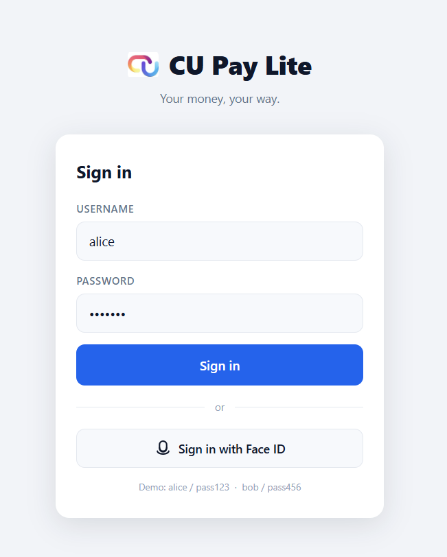

# CU Pay Lite Mobile Banking — IBM QSE + IBM Bob Hand-On Lab

Welcome to the hands-on lab! In this workshop you will use **IBM Quantum Safe Explorer (QSE)** to scan a realistic Java banking application for weak cryptography, then use **IBM Bob** to remediate the findings — all without manually rewriting a single line of code.

---

## Overview

### About This Lab

This lab uses **CU Pay Lite**, a realistic mobile banking demo application built specifically for this workshop. The app simulates real banking features — login, fund transfers, e-slips, device management, and more — while its backend intentionally uses weak cryptographic algorithms that QSE can detect.

You will go through the full quantum-safe remediation cycle:
1. Run the app and explore it as a user
2. Scan the source code with QSE to find cryptographic weaknesses
3. Use IBM Bob to understand and fix those findings
4. Re-scan to confirm the issues are resolved

No deep cryptography knowledge is required. Bob will guide you through each step.

### Goals

| Goal | Description |
|---|---|
| **Understand the problem** | See real cryptographic vulnerabilities in a Java application that QSE can detect |
| **Experience the workflow** | Go through the full QSE scan → Bob remediation → re-scan cycle |
| **See Bob in action** | Watch IBM Bob explain findings in plain language and apply targeted code fixes |
| **Gain confidence** | Leave the lab knowing how to apply quantum-safe remediation to a real Java project |

---

## Demo App Detail

### About the App

**CU Pay Lite** is a single-page mobile banking application with a Java Spring Boot backend and a responsive HTML/CSS/JavaScript frontend.

| Layer | Technology |
|---|---|
| **Backend** | Java 17, Spring Boot — handles authentication, transfers, e-slips, devices, and audit logging |
| **Frontend** | HTML5, CSS3, Vanilla JavaScript — a mobile-first banking UI served as a static SPA |
| **Build tool** | Maven (wrapper included — no global install needed) |
| **Data** | In-memory only — no database, all data resets on restart |

The backend contains **16 cryptographic operations** spread across 7 service classes. Each operation is intentionally implemented with a weak algorithm or key size, making it an ideal target for QSE scanning.

### Project Structure

```
workshop-mobile-banking/
├── pom.xml                             ← Maven build file
├── run.cmd                             ← One-click run script (Windows)
├── mvnw / mvnw.cmd                     ← Maven wrapper (no Maven install needed)
├── README2.md                          ← This file
├── PREREQUISITE.md                     ← Setup guide
└── src/main/
    ├── java/demo/
    │   ├── DemoApplication.java        ← Spring Boot entry point
    │   ├── BankController.java         ← REST API for the banking UI
    │   ├── DemoController.java         ← Workshop operator panel API
    │   ├── AuthService.java            ← Login key generation, token sign/verify
    │   ├── TransferService.java        ← Transfer sign/verify, HMAC, checksum
    │   ├── SlipService.java            ← E-slip sign/verify, statement checksum
    │   ├── AuditService.java           ← Audit-log HMAC
    │   ├── DeviceService.java          ← Device registration key generation
    │   ├── PartnerService.java         ← Partner DH key exchange
    │   └── ProfileService.java         ← Profile checksum
    └── resources/
        ├── application.properties
        └── static/
            ├── index.html              ← Banking SPA (main UI)
            ├── app.js                  ← Frontend logic
            └── styles.css              ← Mobile banking design system
```

---

## Demo App Walkthrough

Before scanning, get familiar with the app as a user would experience it.

### Start the Application

Open a terminal in the project root folder and run:

**PowerShell (Windows)**
```powershell
.\run.cmd
```

**Command Prompt (Windows)**
```cmd
run.cmd
```

**Terminal (macOS)**
```bash
./mvnw spring-boot:run
```

Wait for the startup message:

```
Scanning for projects...
```
If it startup successfully, you will see this message in the terminal at the bottom:

```
[SUCCESS] Application started successfully on http://localhost:8080
```

Then open your browser and go to:

```
http://localhost:8080
```

---

### App Pages Walkthrough


Use the following credentials to log in and explore the app:

| Username | Password |
|---|---|
| alice | pass123 |
| bob | pass456 |

| # | Screen | How to Reach | What it Shows |
|---|---|---|---|
| 1 | **Login** | Open `http://localhost:8080` | Username + password form |
| 2 | **Home Dashboard** | After login | Account balance, quick actions, recent transactions |
| 3 | **Accounts** | Bottom nav → Accounts tab | Account list and balances |
| 4 | **Send Money** | Home → "Send Money" button | Transfer form with recipient and amount |
| 5 | **Transfer Success** | After submitting a transfer | Confirmation screen |
| 6 | **E-Slip / Receipt** | Transfer Success → "View E-Slip" | Signed digital receipt |
| 7 | **Profile & Security** | Bottom nav → Profile | User info and security settings |
| 8 | **Registered Devices** | Profile → "Manage Devices" | List of registered devices |
| 9 | **Notifications** | Bell icon or bottom nav → Alerts | Transaction and security alerts |

<!-- Image placeholder: Login screen -->
 

---

## Hands-On Lab

### STEP 1 — Scan with IBM QSE

In this step you will point QSE at the app's Java source code and review the findings.

#### Run the scan

1. Open **VS Code or Bob IDE**.
2. Click the search box at the top of the window (or press Ctrl + Shift + P), then type >Quantum Safe Explorer: Scan and press Enter.
3. In the QSE panel, set the **scan target** to the Java source directory:


4. Click **Start Scan** and wait for the scan to complete.

<!-- Image placeholder: QSE panel with scan target set -->


#### Review the results

QSE will display findings in two places:

- **Dashboard** — a visual summary of all cryptographic vulnerabilities found
- **`result.json`** — a detailed machine-readable report saved in the project folder (`qs_scan_result/`)

<!-- Image placeholder: QSE dashboard showing findings -->


<!-- Image placeholder: result.json file content -->


Expected findings: approximately **20–25 cryptographic vulnerabilities** across 7 service classes, including weak RSA key sizes (1024-bit), weak DH key sizes (1024-bit), SHA1withRSA signatures, HmacSHA1 MACs, and SHA-1 digests.

---

### STEP 2 — Remediate with IBM Bob

Bob works through a series of prompts in different modes. Follow each prompt in order.

---

#### 2.1 — Initialize Bob (Agent Mode)

Switch Bob to **Agent** mode, then run:

```
/init
```

This tells Bob to read and index the project so it understands the codebase before you ask it to do anything.

<!-- Image placeholder: Bob /init in Agent mode -->


---

#### 2.2 — Understand the Findings (Plan Mode)

Switch Bob to **Plan** mode, then send this prompt:

```
Please review the IBM QSE scan result for this app and explain the findings to me in simple terms.
For each important finding, tell me:
- what is weak
- where it is used in the app
- why it is a problem
- what kind of change would normally fix it
Keep the explanation simple because I'm still new to cryptography and PQC.
Don't change any code yet.
```

Bob will explain each finding in plain language — what the weak algorithm is, where it appears in the banking app, and why it matters. Read through Bob's response before moving to the next step.

<!-- Image placeholder: Bob explaining QSE findings in Plan mode -->


---

#### 2.3 — Fix the Weak Crypto (Agent Mode)

Switch Bob to **Agent** mode, then send this prompt:

```
Please help fix the weak crypto in this app.
Mostly change weak key sizes and algorithm strings to stronger ones.
Keep the same methods, code structure, and crypto operations.
Please don't remove, merge, or replace crypto functions with a different design.
Only change the source code. Don't build or run the app.
```

Bob will make targeted changes across the 7 service classes — upgrading algorithm strings and key sizes while keeping every method name, API call pattern, and business logic intact.

<!-- Image placeholder: Bob applying fixes in Agent mode -->


---

#### 2.4 — Review What Changed (Ask Mode)

Switch Bob to **Ask** mode, then send this prompt:

```
Please explain what you changed.
For each change, show the file, old crypto value, new crypto value, and why it is better.
Also confirm you kept the same methods and crypto operations.
Don't edit the code again.
```

Bob will produce a summary table of every change it made — old value, new value, and the reason. Use this to verify the remediation looks correct before re-scanning.

<!-- Image placeholder: Bob summarizing changes in Ask mode -->


---

### STEP 3 — Re-scan with QSE

Run the QSE scan again using the same steps as STEP 1 to confirm the findings have been resolved.

1. Click the **Quantum Safe Explorer** icon in the Activity Bar.
2. Set the scan target to `src/main/java/demo` again.
3. Click **Start Scan**.

<!-- Image placeholder: QSE dashboard after remediation showing reduced findings -->


Expected result: findings drop from **~20–25 down to ~4–7** (remaining findings are acceptable or informational).

| Metric | Before Bob | After Bob |
|---|---:|---:|
| QSE Findings | ~20–25 | ~4–7 |
| Crypto Assets | 16 | 16 |
| Classes changed | 0 | 7 |
| Lines changed | 0 | ~16 |

---

### STEP 4 — Run the Application Again

After remediation, rebuild and run the app to confirm it still works correctly.

**PowerShell (Windows)**
```powershell
.\run.cmd
```

**Command Prompt (Windows)**
```cmd
run.cmd
```

**Terminal (macOS)**
```bash
./mvnw spring-boot:run
```

Open `http://localhost:8080`, log in, and repeat the walkthrough steps from earlier. All features — login, transfers, e-slips, devices — should work exactly as before.

<!-- Image placeholder: App running successfully after remediation -->


---

## Key Takeaways

- **QSE finds, Bob fixes.** The two tools work together — QSE gives you a precise list of what is weak and where, Bob applies the fixes without breaking anything.
- **Algorithm upgrades are safe and targeted.** Bob only changes key sizes and algorithm strings. Every method name, API call, and business flow stays identical.
- **Post-quantum readiness starts with visibility.** You cannot fix what you cannot see. QSE's scan gives you the full picture of your cryptographic posture in minutes.
- **No deep crypto knowledge required.** Bob explains findings in plain language and guides you through the remediation — making quantum-safe security accessible to every developer.

---

## Important Notes & Disclaimer

- **For educational use only.** CU Pay Lite is a workshop demo application. It must not be used in production or deployed to any public environment.
- **Intentionally weak cryptography.** The application contains deliberately insecure algorithms to demonstrate QSE's detection capabilities. This is by design.
- **In-memory data only.** All accounts, transactions, and session data exist only in memory and are lost when the app restarts. No database is used.
- **No real authentication.** The login flow is simulated. Credentials are hardcoded for demo purposes only.
- **Findings count may vary.** The exact number of QSE findings may differ slightly depending on the QSE engine version used.
