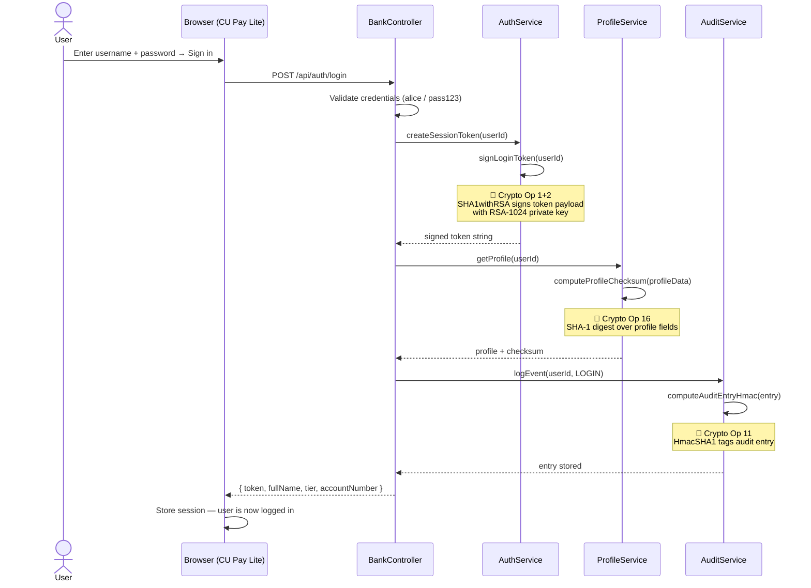
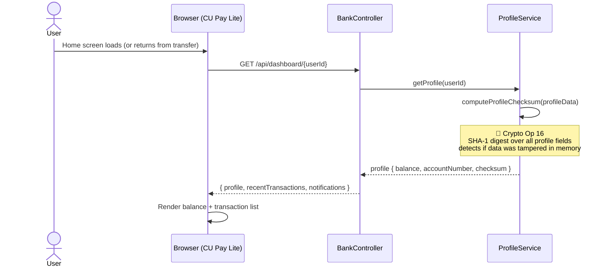
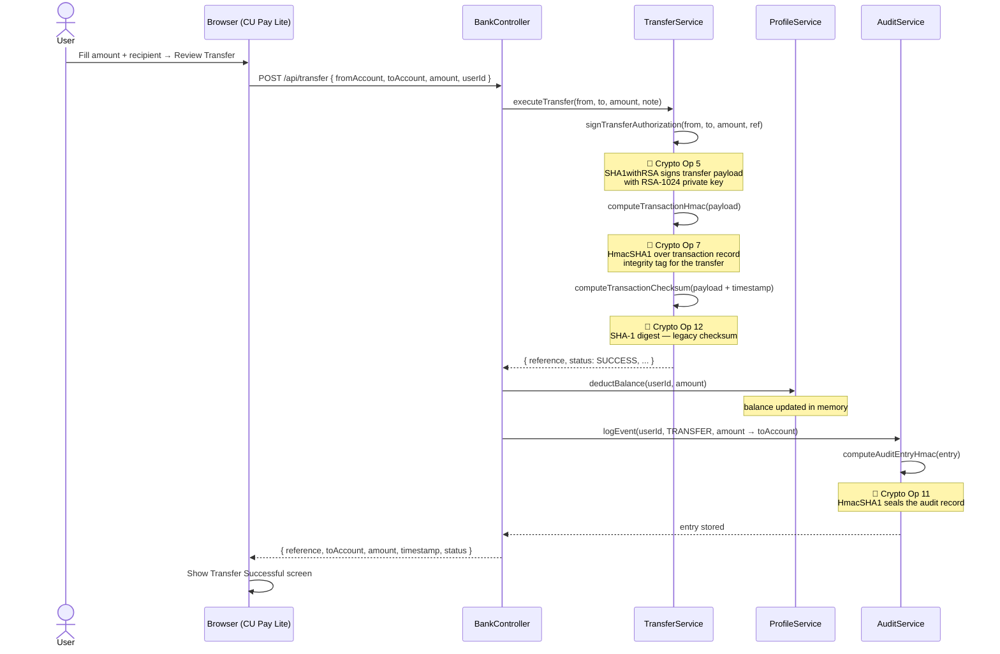
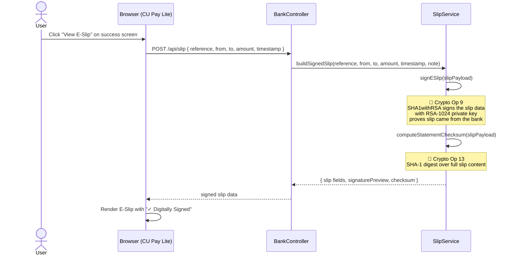
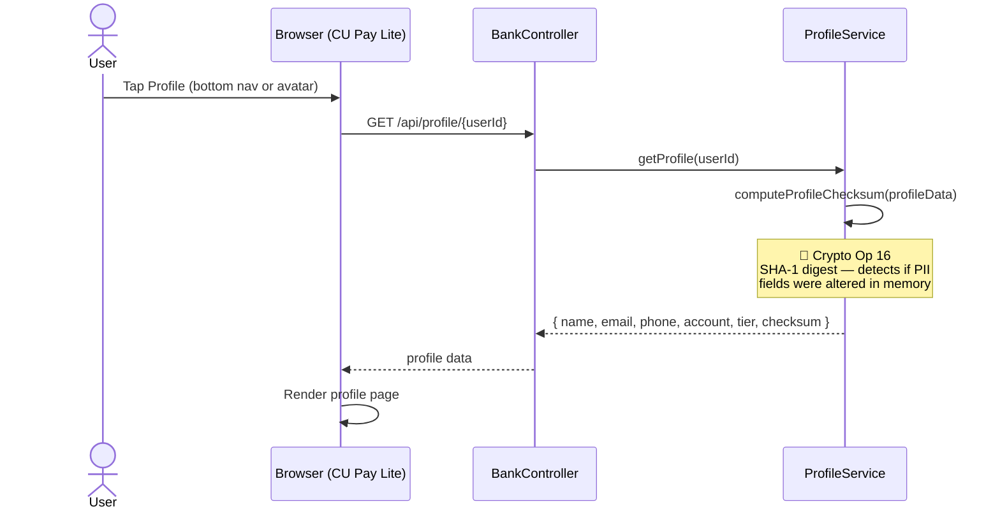
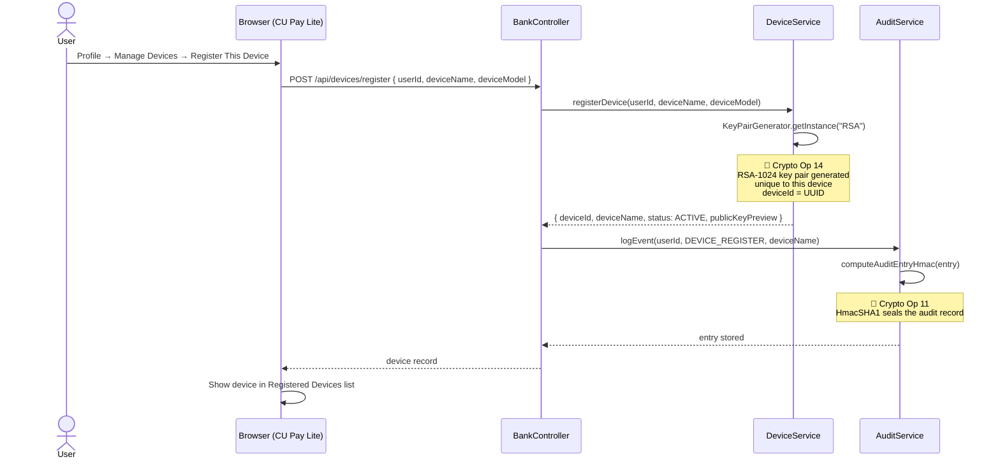
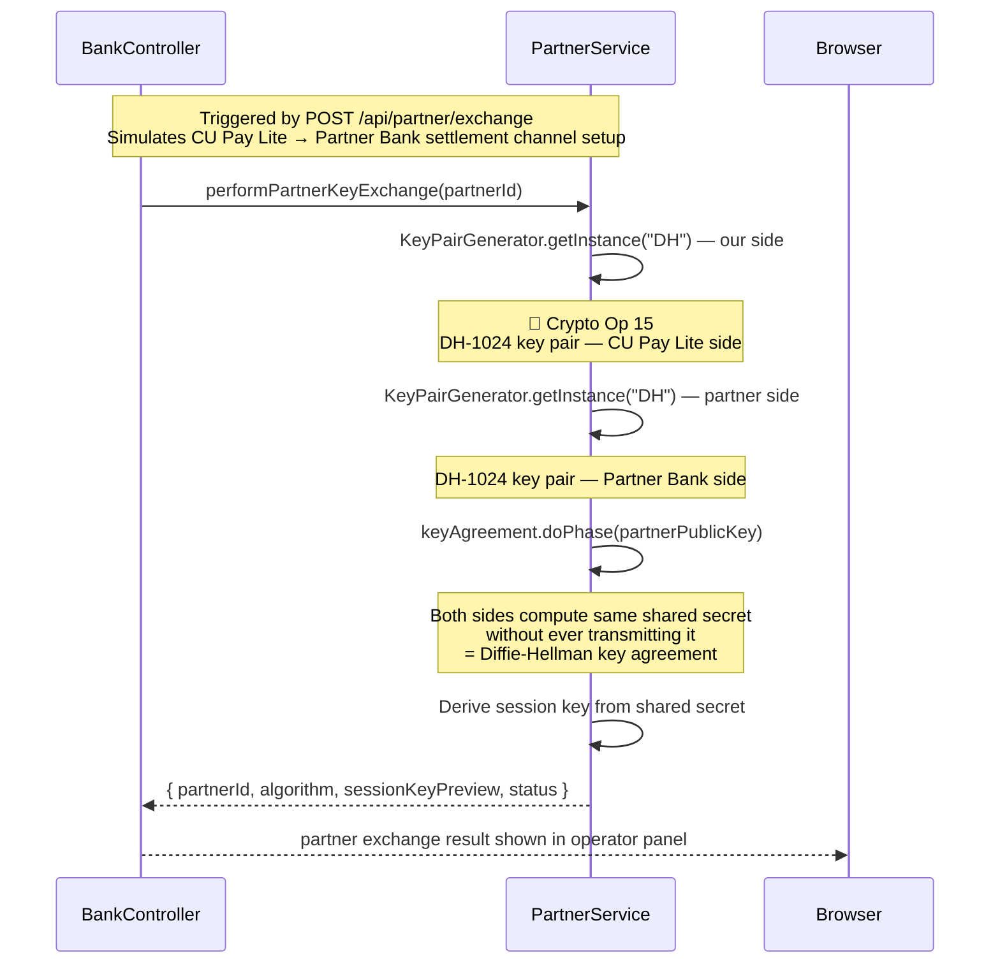
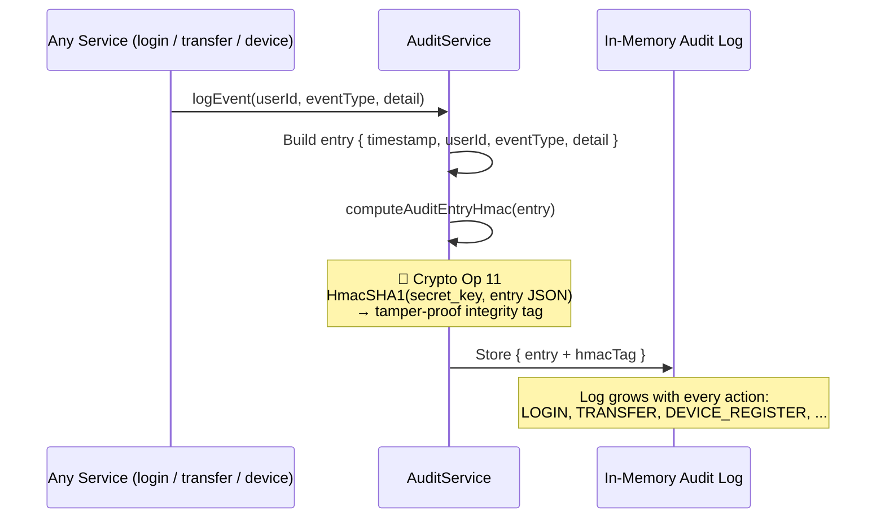

# CU Pay Lite — Security & Encryption Flow Guide

> For demo day attendees — shows every feature in the app and exactly where encryption runs behind the scenes.
> Users never see these operations. They happen automatically on every action.

---

## Table of Contents

1. [App Overview](#1-app-overview)
2. [Demo Flow Summary](#2-demo-flow-summary)
3. [Feature by Feature Flow — Sequence Diagrams](#3-feature-by-feature-flow--sequence-diagrams)
   - [Login](#31--login)
   - [Dashboard / View Balance](#32--dashboard--view-balance)
   - [Transfer Money](#33--transfer-money)
   - [E-Slip / Receipt](#34--e-slip--receipt)
   - [View Profile](#35--view-profile)
   - [Device Registration](#36--device-registration)
   - [Partner Key Exchange](#37--partner-key-exchange-bank-to-bank)
   - [Audit Log](#38--audit-log-every-action)
4. [Step 1 — Login (RSA + SHA1withRSA)](#4-step-1--login-rsa--sha1withrsa)
5. [Step 2 — Transfer (RSA + HmacSHA1 + SHA-1)](#5-step-2--transfer-rsa--hmacsha1--sha-1)
6. [Step 3 — E-Slip (RSA + SHA-1)](#6-step-3--e-slip-rsa--sha-1)
7. [Step 4 — Profile (SHA-1 Checksum)](#7-step-4--profile-sha-1-checksum)
8. [Step 5 — Device Registration (RSA)](#8-step-5--device-registration-rsa)
9. [Step 6 — Partner Key Exchange (DH)](#9-step-6--partner-key-exchange-dh)
10. [Crypto Inventory — Full CBOM Table](#10-crypto-inventory--full-cbom-table)
11. [Why Quantum Computers Break These](#11-why-quantum-computers-break-these)

---

## 1. App Overview

**CU Pay Lite** is a realistic mobile banking demo application built for the **IBM Quantum Safe Explorer (QSE)** + **IBM Bob** workshop.

The story for demo day:

> *"Every mobile banking app runs encryption silently behind every single action — login, transfer, viewing a receipt, even loading your profile. The user never sees it. Today we will open the hood and show you exactly where it runs, why it matters, and what happens when those algorithms become vulnerable to quantum computers."*

The app uses **intentionally weak cryptography** — real and functional, not mocked — so IBM QSE can scan and find it, and IBM Bob can fix it.

```
src/main/java/demo/
├── BankController.java     ← REST API — orchestrates all features
├── AuthService.java        ← Login: RSA key gen + SHA1withRSA token signing
├── TransferService.java    ← Transfer: RSA sign + HmacSHA1 + SHA-1 checksum
├── SlipService.java        ← E-Slip: RSA sign + SHA-1 statement checksum
├── AuditService.java       ← Every action: HmacSHA1 audit integrity
├── DeviceService.java      ← Device register: RSA key gen per device
├── PartnerService.java     ← Bank-to-bank: DH key exchange
└── ProfileService.java     ← Profile load: SHA-1 data checksum
```

**Demo credentials:**

| Username | Password |
|---|---|
| alice | pass123 |
| bob | pass456 |

---

## 2. Demo Flow Summary

```
1. Sign in (alice / pass123)
   └─→ RSA-1024 key pair generated at startup
       SHA1withRSA signs the session token

2. Home Dashboard loads
   └─→ SHA-1 checksum computed over profile data

3. Transfer money (e.g. $250 to NP-0002-2024)
   └─→ SHA1withRSA signs the transfer authorization
       HmacSHA1 computes transaction integrity tag
       SHA-1 computes transaction checksum
       HmacSHA1 writes tamper-proof audit entry

4. View E-Slip / Receipt
   └─→ SHA1withRSA signs the slip
       SHA-1 computes statement checksum

5. View Profile
   └─→ SHA-1 checksum computed over profile data

6. Register Device
   └─→ RSA-1024 key pair generated for the device

7. Partner Key Exchange (bank-to-bank settlement)
   └─→ DH-1024 generates shared session key between banks

8. (IBM QSE scans source) → finds all 16 weak crypto operations
9. (IBM Bob remediates)   → upgrades each weak algorithm in ~16 lines
```

---

## 3. Feature by Feature Flow — Sequence Diagrams

> Each diagram shows exactly which Java class and algorithm runs at every step.
> The user only sees the result (token, balance, receipt). Everything below the line is invisible to them.

---

### 3.1 — Login



**What the user sees:** just the home dashboard appearing after clicking Sign in.

**What ran silently:** RSA-1024 key pair (generated at startup), SHA1withRSA signature on the token, SHA-1 profile checksum, HmacSHA1 audit entry.

---

### 3.2 — Dashboard / View Balance



**What the user sees:** their current balance and recent transactions.

**What ran silently:** SHA-1 checksum over the profile record every time it is loaded — any in-memory tampering would be detected.

---

### 3.3 — Transfer Money



**What the user sees:** "Transfer Successful" with reference number and amount.

**What ran silently:** RSA-1024 signature authorizing the transfer, HmacSHA1 integrity tag on the transaction, SHA-1 checksum, and a HmacSHA1-sealed audit entry written to the log.

---

### 3.4 — E-Slip / Receipt



**What the user sees:** a receipt showing "✓ Digitally Signed".

**What ran silently:** RSA-1024 signs the entire slip so the receipt cannot be forged or altered. The SHA-1 checksum detects any change to the statement content.

---

### 3.5 — View Profile



**What the user sees:** their name, email, phone, account number, and security score.

**What ran silently:** SHA-1 checksum computed over all profile fields — any modification to the data in memory would cause the checksum to fail.

---

### 3.6 — Device Registration



**What the user sees:** a new device appearing in the Registered Devices list as "ACTIVE".

**What ran silently:** an RSA-1024 key pair is generated uniquely for this device — this is how the bank cryptographically identifies trusted devices in a real deployment.

---

### 3.7 — Partner Key Exchange (Bank-to-Bank)



**What the user sees:** (operator panel only) — a session key preview and confirmation that the bank-to-bank channel was established.

**What ran silently:** DH-1024 key agreement. Both sides compute an identical shared secret using math (modular exponentiation) — the secret never travels over the wire. This is how two banks establish a secure settlement channel.

---

### 3.8 — Audit Log (Every Action)

Every feature above writes an audit entry. This diagram shows what happens inside `AuditService` on every call:



**What this protects:** if anyone modifies an audit entry after it was written, the HMAC tag no longer matches — the tampering is detected when the log is read back.

---

## 4. Step 1 — Login (RSA + SHA1withRSA)

### What Happens

1. User submits username + password
2. Credentials are checked against the in-memory user store
3. If valid → `AuthService.createSessionToken()` is called
4. A session token is **signed with RSA-1024 using SHA1withRSA**
5. The token is returned to the browser and used on all future requests

### RSA Token Signing

```
Token payload:  "alice|2026-10-05T22:22:00"
                         ↓
              SHA1withRSA sign with RSA-1024 private key
                         ↓
              Base64-encoded signature string
```

- The bank's **private key** creates the signature (never leaves the server)
- Any service can **verify** the token using the public key
- If the token is altered, verification fails → request rejected

### Why RSA-1024 Is Weak

| Key size | Classical attack | Quantum attack (Shor's) |
|---|---|---|
| RSA-1024 | Factoring takes years — but feasible today | Minutes |
| RSA-3072 | Infeasible classically | Still broken by Shor's — but much harder |

> **Bob's fix:** `generator.initialize(1024)` → `generator.initialize(3072)`

**Files:** [`AuthService.java`](src/main/java/demo/AuthService.java)

---

## 5. Step 2 — Transfer (RSA + HmacSHA1 + SHA-1)

### Three Crypto Operations in One Transfer

Every transfer runs three separate cryptographic operations:

| Operation | Algorithm | Purpose |
|---|---|---|
| Transfer Authorization | SHA1withRSA (RSA-1024) | Proves the transfer instruction is authentic |
| Transaction HMAC | HmacSHA1 | Integrity tag — detects if record is altered |
| Transaction Checksum | SHA-1 | Legacy fingerprint of the transaction data |

### HmacSHA1 — What It Does

```
HMAC(secret_key,  "NP-0001-2024|NP-0002-2024|250.00|TXN69293E62")
      ↓
      fixed-length authentication tag
```

- If even one character in the transaction record changes → tag is completely different
- Only someone with the **secret key** can produce a valid tag
- **Weak because:** SHA-1 as the underlying hash is broken (SHAttered collision, 2017)

> **Bob's fix:** `Mac.getInstance("HmacSHA1")` → `Mac.getInstance("HmacSHA256")`

**Files:** [`TransferService.java`](src/main/java/demo/TransferService.java)

---

## 6. Step 3 — E-Slip (RSA + SHA-1)

### What the Digital Signature on a Slip Means

> The bank signs the slip when it is created. The signature proves the receipt is genuine and has not been altered.

```
SIGN (on /api/slip):
    slip content  →  SHA1withRSA sign with RSA-1024 private key  →  signature

VERIFY (conceptually):
    slip content + signature  →  SHA1withRSA verify with public key
    → match    = VALID   ✔  (slip is authentic, unmodified)
    → mismatch = TAMPERED ✘  (slip was altered after signing)
```

### Why This Matters

An attacker who intercepts a slip cannot change the amount without invalidating the signature — they do not have the private key to create a new valid signature.

**Under quantum threat:** Shor's algorithm can derive the RSA private key from the public key → attacker can forge any receipt signature.

> **Bob's fix:** `Signature.getInstance("SHA1withRSA")` → `Signature.getInstance("SHA256withRSA")`

**Files:** [`SlipService.java`](src/main/java/demo/SlipService.java)

---

## 7. Step 4 — Profile (SHA-1 Checksum)

### What the Checksum Does

Every time a profile is loaded (dashboard, profile page), a SHA-1 checksum is computed over all profile fields:

```
SHA-1( "alice|Alice Sutton|alice.sutton@example.com|NP-0001-2024|12340.50|..." )
  ↓
"3f4a8c2b1e..."  (40-char hex digest)
```

- If any field changes between writes and reads, the checksum changes
- Provides basic **data integrity detection** for in-memory profile records

### Why SHA-1 Is Weak

SHA-1 is a broken hash function. The SHAttered attack (2017) demonstrated real-world **collision attacks** — two different inputs producing the same hash. This means an attacker could substitute data while keeping the checksum unchanged.

> **Bob's fix:** `MessageDigest.getInstance("SHA-1")` → `MessageDigest.getInstance("SHA-256")`

**Files:** [`ProfileService.java`](src/main/java/demo/ProfileService.java)

---

## 8. Step 5 — Device Registration (RSA)

### What the RSA Key Pair Means for a Device

When a device registers, an RSA-1024 key pair is generated uniquely for it:

```
Device registers
    └─→ RSA-1024 KeyPairGenerator generates { publicKey, privateKey }
        publicKey  → stored with device record (bank knows this device)
        privateKey → would stay on device (proves it is the registered device)
        deviceId   → UUID assigned to device
```

In a real deployment, the device uses its private key to prove identity on every request — the bank verifies using the stored public key.

> **Bob's fix:** `generator.initialize(1024)` → `generator.initialize(3072)`

**Files:** [`DeviceService.java`](src/main/java/demo/DeviceService.java)

---

## 9. Step 6 — Partner Key Exchange (DH)

### The Problem It Solves

When CU Pay Lite needs to send a settlement to a partner bank, both sides must agree on an **encryption key for that session** — without transmitting the key itself over the network.

### Diffie-Hellman in Plain Language

```
Both banks agree on public values: large prime p, generator g

CU Pay Lite  picks secret: a  →  sends  g^a mod p  (public, safe to send)
Partner Bank picks secret: b  →  sends  g^b mod p  (public, safe to send)

CU Pay Lite  computes: (g^b)^a mod p  = g^(ab) mod p  ✅
Partner Bank computes: (g^a)^b mod p  = g^(ab) mod p  ✅

Both arrive at the same session key — the secret values a and b never left each side.
```

### Why DH-1024 Is Weak

| Key size | Security level | Status |
|---|---|---|
| DH-1024 | ~80 bits equivalent | ⚠️ Below NIST minimum since 2015 |
| DH-2048 | ~112 bits equivalent | ✅ Current NIST minimum |

> **Bob's fix:** `dhGen.initialize(1024)` → `dhGen.initialize(2048)`

**Files:** [`PartnerService.java`](src/main/java/demo/PartnerService.java)

---

## 10. Crypto Inventory — Full CBOM Table

This is what IBM QSE detects when it scans `src/main/java/demo/`:

| # | Operation | Class | Method | Weak Algorithm | Bob's Fix |
|---|---|---|---|---|---|
| 1 | Login Key Generation | AuthService | generateLoginKeyPair | RSA **1024** bits | RSA **3072** bits |
| 2 | Login Token Signing | AuthService | signLoginToken | **SHA1**withRSA | **SHA256**withRSA |
| 3 | Login Token Verification | AuthService | verifyLoginToken | **SHA1**withRSA | **SHA256**withRSA |
| 4 | Transfer Key Generation | TransferService | generateTransferKeyPair | RSA **1024** bits | RSA **3072** bits |
| 5 | Transfer Auth Signing | TransferService | signTransferAuthorization | **SHA1**withRSA | **SHA256**withRSA |
| 6 | Transfer Verification | TransferService | verifyTransferAuthorization | **SHA1**withRSA | **SHA256**withRSA |
| 7 | Transaction HMAC | TransferService | computeTransactionHmac | Hmac**SHA1** | Hmac**SHA256** |
| 8 | E-Slip Key Generation | SlipService | generateSlipKeyPair | RSA **1024** bits | RSA **3072** bits |
| 9 | E-Slip Signing | SlipService | signESlip | **SHA1**withRSA | **SHA256**withRSA |
| 10 | E-Slip Verification | SlipService | verifyESlip | **SHA1**withRSA | **SHA256**withRSA |
| 11 | Audit-Log HMAC | AuditService | computeAuditEntryHmac | Hmac**SHA1** | Hmac**SHA256** |
| 12 | Transaction Checksum | TransferService | computeTransactionChecksum | **SHA-1** | **SHA-256** |
| 13 | Statement Checksum | SlipService | computeStatementChecksum | **SHA-1** | **SHA-256** |
| 14 | Device Registration Key Gen | DeviceService | registerDevice | RSA **1024** bits | RSA **3072** bits |
| 15 | Partner Key Exchange | PartnerService | performPartnerKeyExchange | DH **1024** bits | DH **2048** bits |
| 16 | Profile Data Checksum | ProfileService | computeProfileChecksum | **SHA-1** | **SHA-256** |

**QSE expected findings: ~20–25 vulnerabilities across 7 Java files.**

---

## 11. Why Quantum Computers Break These

### Shor's Algorithm (1994)

A quantum algorithm that can efficiently solve the mathematical problems that RSA and DH rely on:

| Hard problem (classical computer) | Algorithm that relies on it | Quantum attack |
|---|---|---|
| Factor large numbers | RSA (all key sizes) | Shor's algorithm — minutes |
| Discrete logarithm | DH key exchange | Shor's algorithm — minutes |

SHA-1 and HmacSHA1 are **not broken by Shor's** — they are broken by classical attacks (collision attacks, SHAttered 2017). They still need to be upgraded.

### "Harvest Now, Decrypt Later" Threat

```
Today (no quantum computer yet):
    Attacker records all encrypted interbank traffic
    Cannot decrypt it — yet

Future (quantum computer exists):
    Attacker runs Shor's algorithm on the recorded traffic
    Breaks the RSA and DH keys
    Reads every transaction, session key, and transfer from years ago
```

This is why banks need to act **before** quantum computers arrive — not after. Historical encrypted data is already at risk.

### Post-Quantum Replacements (what QSE recommends)

| Current (vulnerable) | Vulnerability | Post-quantum replacement |
|---|---|---|
| RSA-1024 signatures | Shor's algorithm | CRYSTALS-Dilithium |
| DH-1024 key exchange | Shor's algorithm | CRYSTALS-Kyber |
| SHA1withRSA | Shor's + weak hash | SHA256withRSA → Dilithium |
| HmacSHA1 | SHA-1 collision attacks | HmacSHA256 |
| SHA-1 digests | SHA-1 collision attacks | SHA-256 |

### The QSE → Bob Value Proposition

```
IBM QSE scans source code
    └─→ Produces CBOM (Cryptography Bill of Materials)
            └─→ Lists every algorithm, file, line number, severity
                    └─→ IBM Bob reads the findings
                            └─→ Remediates each weak algorithm in-place
                                    └─→ ~16 line changes across 7 files
                                            └─→ Re-scan: findings drop from ~20–25 to ~4–7
```

Without QSE, a bank would need to manually audit every file in every service to find all crypto usage. For a large bank with hundreds of services, that takes years. **QSE automates the discovery. Bob automates the fix.**

---

*CU Pay Lite · IBM QSE + IBM Bob Workshop · Educational use only*
